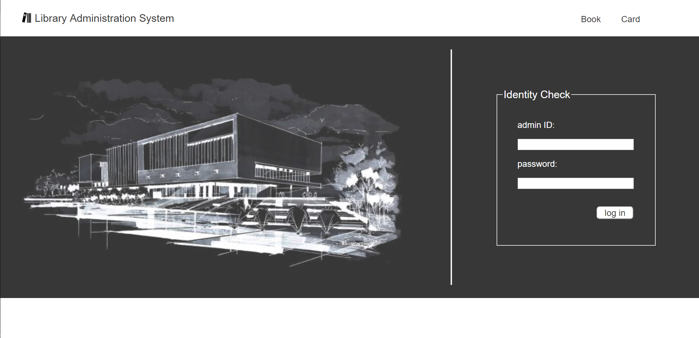
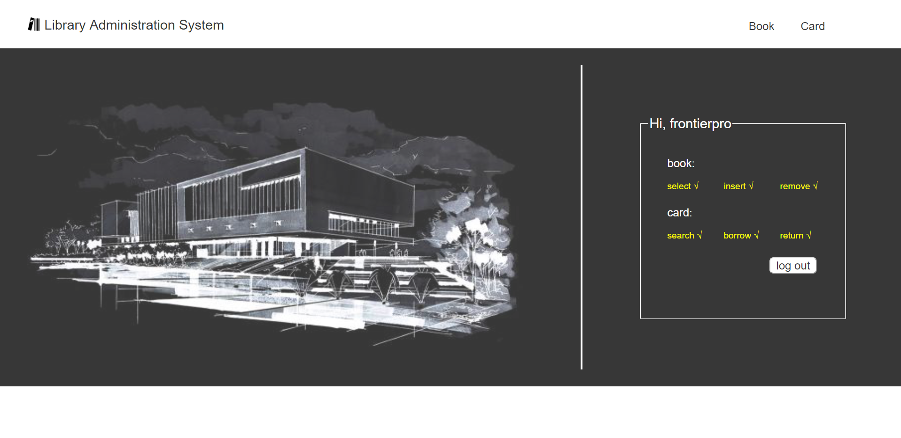
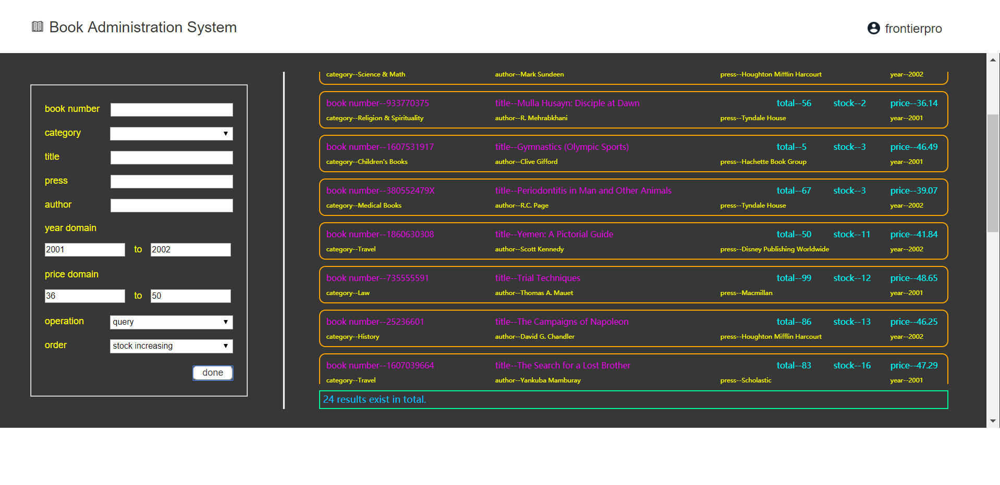
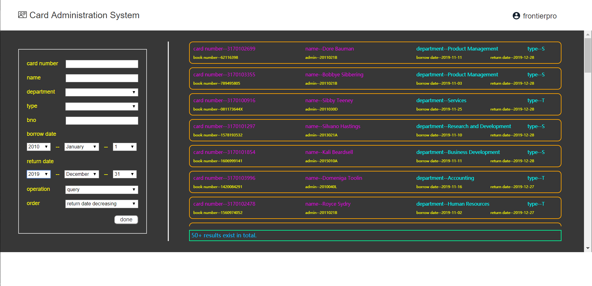

# Library Admin System

This is a library administration system implemented based on ajax technology (html+css+javascript【original】for front end and php+mysql for back end)

## Introduction

<em>Attention!</em>

Environment building is very important.

We need to build a development environment with some useful tools.

\-&emsp;[Apache Server](http://www.apachelounge.com/download/)

Choosing Apache (any version) Win64

My install absolute path is ```C:/apache/Apache24```

\-&emsp;[PHP](https://windows.php.net/download)

Choosing VC(anything) x64 Thread Safe (anytime)

My install absolute path is ```C:/php```

\-&emsp;[MySQL](https://dev.mysql.com/downloads/installer/)

My install absolute path is ```C:/mysql/mysql-8.0.17-winx64```

Then it comes to configuration, it is a bit complicated.

* Apache Server

We should edit the file ```Apache24/conf/httpd.conf```.

Find ```Define SRVROOT "..."```, change it to ```Define SRVROOT "C:/apache/Apache24"```(which represents the Apache install absolute path).

Add the following code at the tail of the file.

```
# php7 support
LoadModule php7_module "C:/php/php7apache2_4.dll"
AddType application/x-httpd-php .php .html .htm

# configure the path to php.ini
PHPIniDir "C:/php"
```

These code add the support to PHP7 for Apache Server.

Add ```C:/apache/Apache24/bin``` to system ```PATH``` variable.

Use ```httpd.exe -k install``` command to install Apache Service Monitor.

Start service in the monitor.

You can enter ```localhost``` or ```localhost/index.html``` in the address bar of the browser to check whether the server is working.

In fact, ```localhost``` is corresponding to ```C:/apache/Apache24/htdocs```

* PHP

You should copy ```C:/php/php.ini-development```, place the transcript under the same path and rename it as ```php.ini```.

Then edit this ```php.ini``` file.

Find ```extension_dir = "..."```, change to ```extension_dir = "C:/php/ext"```(which is the base absolute address of the php extention loading model).

Find ```;extension=mysqli```, change it to ```extension=php_mysqli.dll```(which add the support to mysql visit for php).

Add ```C:/php``` and ```C:/php/ext``` to system ```PATH``` variable.

* MySQL

New a System variable called ```MYSQL_HOME```, its value is ```C:/mysql/mysql-8.0.17-winx64```(the install absolute path).

Then add ```%MYSQL_HOME%/bin``` to system ```PATH``` variable.

Use ```start mysqld``` command to start mysql service.

Okay~, above is the whole configuration process. Here I suggest the configure order is mysql->php->apache.

## Using Method

Download this repo and unzip it.

Place the folder under ```C:/apache/Apache24/htdocs```(localhost)

Use the following commands in mysql to import initial data.

```
source C:/apache/Apache24/htdocs/Library_Admin_System/sql/Library.sql
source C:/apache/Apache24/htdocs/Library_Admin_System/sql/Admin.sql
source C:/apache/Apache24/htdocs/Library_Admin_System/sql/Book.sql
source C:/apache/Apache24/htdocs/Library_Admin_System/sql/Card.sql
source C:/apache/Apache24/htdocs/Library_Admin_System/sql/Borrow.sql
```

Enter ```http://localhost/Library_Admin_System/index/Index.html``` in the address bar of the browser.

Then it works!

## Effect Display

* 【Index Page】```http://localhost/Library_Admin_System/index/Index.html```



The initial admin ID and password can be checked in [admin.sql](sql/admin.sql).

* 【Home Page】```http://localhost/Library_Admin_System/home/Home.html```



Here I log in with the administrator with the highest authority. The specific authority can be checked in the right part.

* 【Book Query Page】```http://localhost/Library_Admin_System/book/Book.html```



Set situations in the left part, and the book info will be shown on the right part (a embedded page).

* 【Card Query Page】```http://localhost/Library_Admin_System/card/Card.html```



Same operations to the book query page.

So, this repo is just a demo, so many extensions can be added into this system.
